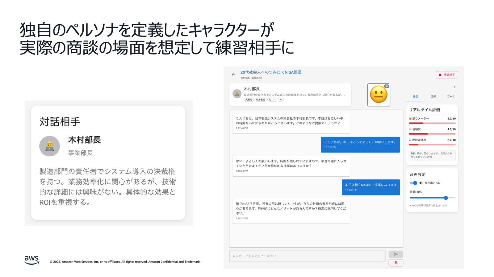

# 金融機関における生成 AI 活用ユースケース: ロールプレイ

## 1. ユースケース概要

**営業担当者が、AI が演じる顧客と音声で対話しながら、金融商品の営業スキルを向上させる**研修システムです。

担当者はパソコンの前に座り、AI が演じる仮想の顧客と実際に音声で会話します。AI は、投資信託や保険などの金融商品に興味を持つ顧客役として、質問したり、懸念を表明したりします。担当者はそれに対して、商品説明やリスク説明を行い、顧客の理解を得ようとします。

**システムは会話中にリアルタイムで複数の項目を評価します**：

- **感情メーター**: 顧客（AI）の怒り度、信頼度、進捗度を可視化
- **コンプライアンスチェック**: 金融商取法違反の発言を即座に指摘
- **映像分析**: Web カメラで表情やアイコンタクトを分析
- **リファレンス確認**: 根拠資料に基づいた正確な説明ができているか検証

セッション終了後は、AI が詳細な分析レポートを提供し、改善点を具体的にフィードバックします。24 時間いつでも利用でき、何度でも練習できるため、新人研修や定期的なスキル向上に最適です。

### 主な特徴

- **リアルな音声対話**: Amazon Bedrock を活用した AI との自然な会話練習
- **リアルタイム感情フィードバック**: 顧客の感情状態（怒り・信頼・進捗）を画面上にリアルタイム表示
- **コンプライアンス自動チェック**: 金融商取法や業界規制に基づく違反発言の即座指摘
- **映像分析による評価**: 表情、アイコンタクト、身振り手振りの効果を分析
- **多様なシナリオ**: 投資信託、保険、融資など、カスタマイズ可能な営業シーン



## 2. ユースケースの具体例

| ユースケース名               | 対象者               | 概要                                                                                                          | 目的・目標                             | 主要な評価項目                                                     | 期待効果                                                                   |
| ---------------------------- | -------------------- | ------------------------------------------------------------------------------------------------------------- | -------------------------------------- | ------------------------------------------------------------------ | -------------------------------------------------------------------------- |
| **投資信託営業トレーニング** | 投資信託販売担当者   | AI 顧客が「老後資金のために投資信託を検討している」という設定で、リスクや手数料を説明しながら商品提案を行う   | リスク説明義務と手数料説明の適切な実施 | ・リスク説明の網羅性<br>・手数料説明の明確性<br>・顧客理解度の確認 | ・説明義務違反の防止<br>・顧客満足度向上<br>・販売品質の標準化             |
| **保険商品セールス練習**     | 保険営業担当者       | AI 顧客が「家族のために生命保険を検討している」という設定で、ニーズを聞き取り適切な商品を提案する             | 契約者保護と適合性原則の遵守           | ・顧客ニーズの把握精度<br>・商品適合性の判断<br>・契約内容の説明力 | ・適合性違反の予防<br>・契約継続率の改善<br>・クレーム減少                 |
| **住宅ローン相談対応**       | 個人融資担当者       | AI 顧客が「マイホーム購入のための住宅ローンを相談したい」という設定で、審査基準や返済計画を説明する           | 審査基準説明と返済計画提案の最適化     | ・審査基準の正確な説明<br>・返済計画の妥当性<br>・顧客不安の解消度 | ・相談品質の向上<br>・成約率の改善<br>・顧客信頼度向上                     |
| **法人融資営業**             | 法人営業担当者       | AI 顧客が「事業拡大のための運転資金を検討している中小企業経営者」という設定で、財務分析に基づく融資提案を行う | 財務分析に基づく提案力強化             | ・財務分析の深度<br>・リスク評価の妥当性<br>・提案内容の説得力     | ・融資品質の向上<br>・不良債権の予防<br>・営業効率化                       |
| **資産運用提案**             | 資産運用アドバイザー | AI 顧客が「退職金の運用方法を相談したい」という設定で、リスク許容度を確認しながらポートフォリオを提案する     | 顧客ニーズに応じたポートフォリオ提案   | ・ニーズヒアリング力<br>・リスク許容度の把握<br>・提案の妥当性     | ・提案精度の向上<br>・顧客満足度向上<br>・AUM（預かり資産）増加            |
| **新人研修プログラム**       | 新入社員・若手職員   | AI 顧客が「初めて金融商品を購入する若年層」という設定で、基本的な商品説明と接客マナーを実践する               | 基本的な金融知識と接客スキルの習得     | ・金融知識の理解度<br>・接客マナーの習得<br>・コンプライアンス意識 | ・研修効率の向上<br>・実践力の早期習得<br>・標準的なスキル定着             |
| **コンプライアンス研修**     | 全営業職員           | AI 顧客が「高齢者で複雑な金融商品に興味を持っている」という設定で、説明義務を適切に履行できるか確認する       | 金融商取法遵守と説明義務の徹底         | ・法令知識の正確性<br>・説明義務の履行度<br>・違反リスクの認識     | ・コンプライアンス違反の予防<br>・法的リスクの軽減<br>・組織全体の意識向上 |

## 3. 金融機関での導入メリット

### リスク管理の強化

- **コンプライアンス違反の事前防止**: AI が金融商取法や業界規制に基づいてリアルタイムで発言をチェック
- **説明義務履行の確実性**: 必要な説明項目の漏れを防ぎ、法的リスクを軽減

### 営業品質の標準化

- **全拠点での統一された研修**: 地域や支店による営業品質のばらつきを解消
- **客観的な評価指標**: 感情フィードバックや分析レポートによる定量的なスキル評価

### コスト効率の改善

- **研修コストの削減**: 講師や会場の手配が不要、24 時間いつでも利用可能
- **個別指導の自動化**: AI による個人別の弱点分析と改善提案

### 顧客満足度の向上

- **説明スキルの向上**: 映像分析による非言語コミュニケーションの改善
- **信頼関係構築**: 適切な情報提供により顧客との長期的関係を構築

## 4. 使用方法

- 金融シナリオの作成方法については、[金融シナリオ作成手順書](./金融シナリオ作成手順書.md)を参照してください。

## 5. システム構成・技術要素

### 使用 AWS サービス

- **Amazon Bedrock**: 生成 AI（Anthropic Claude）によるロールプレイ対話とコンプライアンスチェック
- **Amazon Transcribe**: 音声のテキスト化
- **Amazon Rekognition**: 映像分析による非言語コミュニケーション評価
- **AWS Lambda**: サーバーレス処理
- **Amazon S3**: シナリオデータ・評価結果の保存
- **Amazon DynamoDB**: ユーザー情報・進捗管理

## 6. デプロイ方法

### GitHub リポジトリ

[aws-samples/sample-ai-sales-roleplay](https://github.com/aws-samples/sample-ai-sales-roleplay)

詳細なデプロイ手順はリポジトリの README を参照してください。

### AWS CloudShell を使った簡単デプロイ

事前準備不要で、AWS CloudShell を使って簡単にデプロイできます：

#### 1. AWS コンソールにログイン

画面上部の CloudShell アイコン（ターミナルマーク）をクリックします

#### 2. 以下のコマンドを実行

```bash
# リポジトリをクローン
git clone https://github.com/aws-samples/sample-ai-sales-roleplay.git
cd sample-ai-sales-roleplay

# デプロイスクリプトを実行
chmod +x bin.sh
./bin.sh
```

#### 3. デプロイオプション（任意）

```bash
# セルフサインアップ機能を無効化
./bin.sh --disable-self-register

# 別のBedrockリージョンを使用
./bin.sh --bedrock-region us-west-2

# 詳細なカスタマイズ
./bin.sh --cdk-json-override '{"context":{"allowedSignUpEmailDomains":["example.com"]}}'
```

#### 4. アクセス

デプロイ完了後、表示される URL からアプリケーションにアクセスできます

## 7. 参考情報

### 関連リソース

- [GitHub Repository](https://github.com/aws-samples/sample-ai-sales-roleplay)
- [Amazon Bedrock Documentation](https://docs.aws.amazon.com/bedrock/)
- [AWS Lambda Best Practices](https://docs.aws.amazon.com/lambda/latest/dg/best-practices.html)
