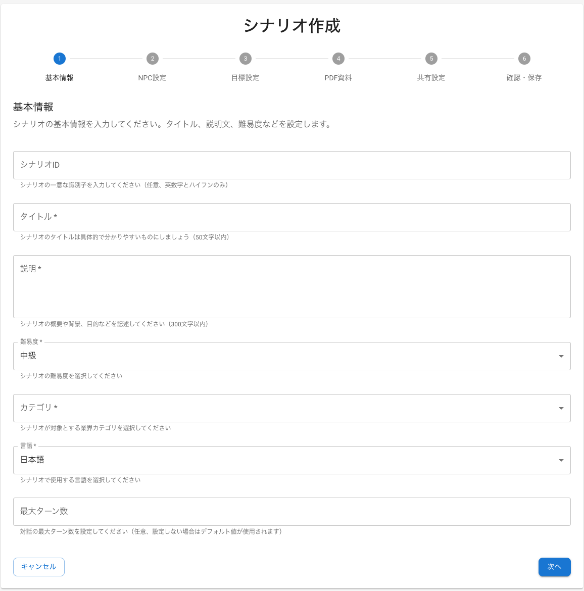
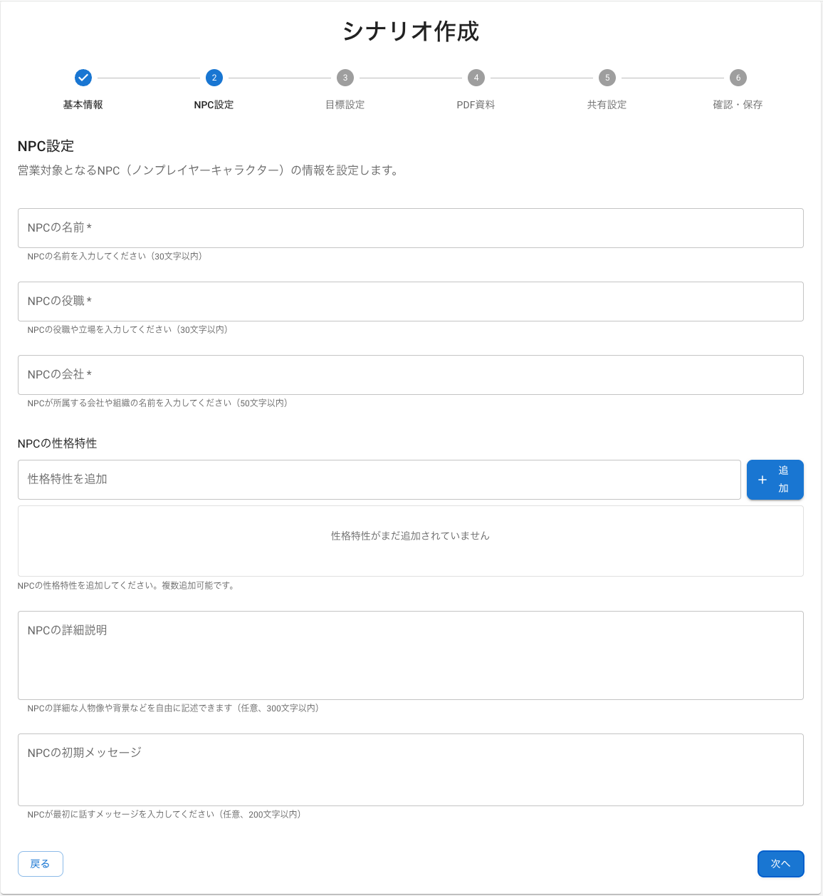
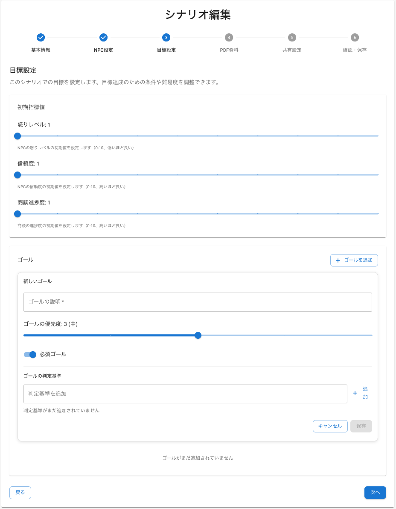
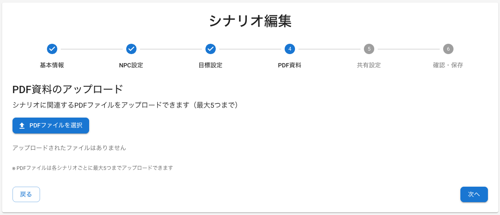
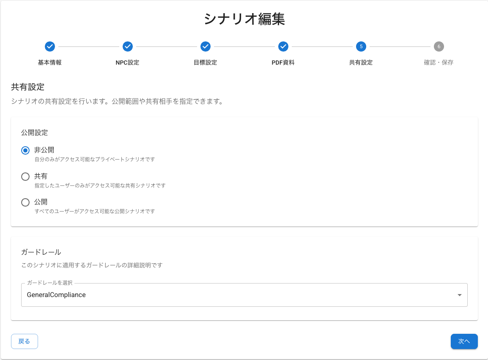

# 金融機関向け AI 営業ロールプレイ シナリオ作成手順書

## 概要

このドキュメントでは、金融機関向け AI 営業ロールプレイシステムにおける効果的なシナリオの作成方法を、6 つのステップで解説します。画面に従って入力していくだけで、金融業界特有のコンプライアンス要件や営業プロセスを考慮したシナリオが完成します。

## シナリオ作成の 6 ステップ

### ステップ 1: 基本情報設定

このステップでは、シナリオの基本的な情報を設定します。シナリオ ID は後から変更できないため、命名規則を参考に慎重に決めてください。



#### 設定項目

以下の項目を設定します：

- **シナリオ ID**: 一意識別子（英数字とハイフンのみ）
- **タイトル**: シナリオの目的が明確に分かる名前（50 文字以内）
- **説明**: シナリオの概要と目的（300 文字以内）
- **難易度**: 初級・中級・上級・エキスパートから選択
- **カテゴリ**: 対象する業界カテゴリ
- **言語**: 日本語/英語
- **最大ターン数**: 対話の上限回数

#### 金融業界特有のポイント

金融機関でシナリオを作成する際は、以下のポイントに注意してください。

**シナリオ ID 命名規則**

シナリオを管理しやすくするため、以下のような命名規則を推奨します：

```
金融商品_難易度_用途
例：
- investment-trust-beginner-risk-explanation
- life-insurance-advanced-suitability-check
- housing-loan-intermediate-consultation
```

**タイトル例**

シナリオの目的が一目で分かるタイトルをつけましょう。以下は参考例です：

- 投資信託の初回面談（リスク説明重点）
- 生命保険の適合性確認面談
- 住宅ローン相談（返済計画提案）
- 法人融資の財務分析面談

**説明文のテンプレート**

説明欄には、以下のテンプレートを参考に具体的な内容を記載してください：

```
[商品名]の[営業プロセス]において、[重要なコンプライアンス要件]を適切に履行し、顧客の[ニーズ/課題]に対応するスキルを養うシナリオです。特に[評価対象のスキル]の向上を目指します。
```

**難易度設定基準**

対象者のスキルレベルに応じて、以下を目安に難易度を設定します：

- **初級**: 基本的な商品説明、コンプライアンス用語の理解
- **中級**: 顧客ニーズの把握、適合性判断、リスク説明
- **上級**: 複雑な提案、異議処理、クロスセル
- **エキスパート**: 危機管理、複雑な法的問題対応、業界専門知識を要する高度な提案

**最大ターン数の目安**

難易度に応じて、以下を目安にターン数を設定します：

- 初級: 10-15 ターン
- 中級: 15-25 ターン
- 上級: 25-40 ターン
- エキスパート: 40-60 ターン

### ステップ 2: NPC（顧客）設定

このステップでは、AI が演じる顧客（NPC）のキャラクター設定を行います。リアルな顧客像を設定することで、より実践的なロールプレイが可能になります。



#### 設定項目

以下の項目を設定します：

- **NPC の名前**: 顧客名（30 文字以内）
- **NPC の役職**: 顧客の職業・立場（30 文字以内）
- **NPC の会社**: 所属組織（50 文字以内）
- **NPC の性格特性**: 追加可能な特性設定
- **NPC の詳細説明**: 背景情報、詳細なペルソナの定義（300 文字以内）
- **NPC の初期メッセージ**: 最初の発言（200 文字以内）

#### 金融業界特有のポイント

**NPC の詳細説明欄の活用**

NPC の詳細説明欄は、AI が一貫したキャラクターを演じるための重要な設定項目です。以下の要素を含めて具体的に記述してください：

**ペルソナ定義テンプレート**

```
【基本情報】年齢、職業、家族構成、居住地域、年収帯
【性格・価値観】リスク許容度、意思決定スタイル、金融に対する考え方
【過去の経験】金融商品の利用歴、過去のトラブルや成功体験
【現在の状況】資産状況、ライフステージ、抱えている課題
【目標・ニーズ】短期・長期の目標、解決したい問題
【コミュニケーション特性】話し方、専門用語の理解度、情報収集スタイル
【感情的特徴】不安を感じるポイント、信頼を築くために重要な要素
```

**顧客ペルソナのパターン**

以下は、金融機関でよく見られる顧客タイプの設定例です。これらを参考に、シナリオに合わせてカスタマイズしてください：

1. **保守的な高齢者**

```
名前: 田中太郎様
詳細説明: 65歳、元大手メーカー経理部長、妻と二人暮らし。退職金2000万円と企業年金で生活。過去に株式投資で損失経験があり、元本保証を重視。詳しい説明を求め、即決を嫌う。銀行預金中心の資産運用で、相続対策にも関心。数字に強く、手数料や税金に敏感。丁寧な対応と十分な検討時間を必要とする。
```

2. **積極的な働き盛り**

```
名前: 佐藤花子様
詳細説明: 40歳、IT企業マネージャー、夫と子供2人の4人家族。世帯年収1200万円。時間を重視し、効率的な情報提供を求める。データ分析が得意で、投資経験もあり。教育資金準備と住宅ローン返済を並行し、税務対策にも積極的。論理的な説明を好み、感情論より数字とエビデンスを重視する。
```

3. **初心者の若年層**

```
名前: 山田次郎様
詳細説明: 25歳、新入社員、年収400万円、一人暮らし。金融知識は乏しいが学習意欲が高い。将来への漠然とした不安を抱え、「何から始めればよいか分からない」状態。専門用語に不慣れで、分かりやすい説明を求める。SNSで情報収集し、同世代の成功事例に関心。小額から始められる商品を希望。
```

**性格特性の設定例**

顧客の性格を以下のような軸で設定すると、よりリアルな対話が実現できます：

- リスク許容度: 低い/普通/高い
- 意思決定スタイル: 即断即決/慎重検討/他者相談
- 金融知識レベル: 初心者/中級者/上級者
- コミュニケーション: 感情的/論理的/データ重視

**初期メッセージ例**

顧客の最初の発言は、シナリオの方向性を決める重要な要素です。以下を参考にしてください：

```
投資信託シナリオ:
「投資信託について相談したいのですが、正直よくわからないことが多くて...。リスクもあると聞いて不安なんです。」

保険シナリオ:
「生命保険の見直しを検討しているんですが、今の保険で十分なのか判断できずにいます。家族構成も変わったので。」
```

### ステップ 3: 目標設定

このステップでは、顧客の初期状態と、ロールプレイで達成すべき目標を設定します。これらの設定により、営業担当者のパフォーマンスを客観的に評価できます。



#### 設定項目

以下の項目を設定します：

- **怒りレベル初期値**: 0-10 の範囲でスライダーにて設定
- **信頼度初期値**: 0-10 の範囲でスライダーにて設定
- **商談進歩度初期値**: 0-10 の範囲でスライダーにて設定
- **ゴール設定**: 達成すべき目標の詳細設定
  - ゴールの説明：目標の具体的な内容を記述
  - ゴールの優先度：1（低）～ 5（高）で設定
  - 必須ゴール：必ず達成すべき目標かどうかの選択
  - 判定基準：ゴール達成を判定するための具体的な基準

#### 金融業界特有のポイント

**初期値設定の考え方**

顧客の初期状態を適切に設定することで、リアルな営業シーンを再現できます。以下を参考に設定してください：

**怒りレベル**

- 0-2: 友好的な顧客（既存顧客、紹介等）
- 3-5: 中立的な顧客（新規、情報収集段階）
- 6-8: やや警戒的な顧客（過去の不満経験あり）
- 9-10: 敵対的な顧客（クレーム対応等）

**信頼度**

- 0-2: 初回面談、警戒心が強い状態
- 3-5: 標準的な新規顧客
- 6-8: 既存顧客、一定の関係構築済み
- 9-10: 長期取引顧客、高い信頼関係

**商談進歩度**

- 0-2: 情報収集段階
- 3-5: ニーズ確認段階
- 6-8: 提案検討段階
- 9-10: 契約直前段階

**ゴール設定の考え方**

各ゴールに以下の要素を設定することで、より精密な評価が可能になります：

**ゴール設定例**

以下は、金融商品別の具体的なゴール設定例です：

**投資信託営業シナリオ**

```
ゴール1: リスク説明の完了
説明：投資信託のリスクについて法的要求事項を満たす説明を行う
優先度：5（高）
必須ゴール：✓（チェック）
判定基準：元本割れリスク、価格変動リスク、信用リスクの3つを説明

ゴール2: 顧客のリスク許容度確認
説明：顧客の投資経験と許容度を適切に把握する
優先度：4（高）
必須ゴール：✓（チェック）
判定基準：年齢、資産状況、投資経験、運用目的を聞き取り

ゴール3: 適合性の確認
説明：提案商品が顧客に適合しているか確認する
優先度：5（高）
必須ゴール：✓（チェック）
判定基準：顧客属性と商品特性の整合性を確認
```

**保険営業シナリオ**

```
ゴール1: 現在の保障状況把握
説明：既存の生命保険や共済の内容を詳しく聞き取る
優先度：4（高）
必須ゴール：✓（チェック）
判定基準：保険種類、保障額、保険料を確認

ゴール2: 必要保障額の算出
説明：家族構成とライフプランに基づき必要保障額を提示
優先度：3（中）
必須ゴール：□（任意）
判定基準：収入、支出、教育費、住宅費を考慮した算出

ゴール3: 商品適合性の確認
説明：提案する保険商品が顧客ニーズに適合するか確認
優先度：5（高）
必須ゴール：✓（チェック）
判定基準：保障内容、保険料、契約期間の妥当性を説明
```

**優先度設定の指針**

ゴールの重要度に応じて、以下を目安に優先度を設定します：

- 5（高）：コンプライアンス関連、法的要求事項
- 4（高）：顧客満足度に直結する重要項目
- 3（中）：営業効果を高める付加価値項目
- 2（低）：長期的な関係構築に関わる項目
- 1（低）：補足的な情報提供項目

### ステップ 4: PDF 資料アップロード

このステップでは、営業時に参照する資料をアップロードします。AI はこれらの資料を参照して、担当者の説明が正確かどうかを評価します。



#### 設定項目

以下の項目を設定します：

- 関連する PDF ファイル（最大 5 つまで）

#### 金融業界特有のポイント

**必要な資料の種類**

金融商品ごとに、以下のような資料をアップロードすることを推奨します：

**投資信託関連**

- 投資信託説明書（目論見書）
- リスク説明資料
- 手数料一覧表
- 運用実績データ
- 適合性確認チェックシート

**保険関連**

- 商品パンフレット
- 保険約款（要約版）
- 保障内容比較表
- 年齢別保険料表
- 告知書・意向確認書

**融資関連**

- 金利表
- 返済シミュレーション
- 審査基準説明書
- 担保評価資料
- 必要書類一覧

### ステップ 5: 共有設定

このステップでは、作成したシナリオの公開範囲と、コンプライアンスチェック機能（ガードレール）を設定します。



#### 設定項目

以下の項目を設定します：

- **公開設定**: 非公開/共有/公開から選択
- **ガードレール**: コンプライアンスチェック機能

#### 金融業界特有のポイント

**公開設定の考え方**

シナリオの用途に応じて、以下を参考に公開範囲を設定します：

- **非公開**: 個人練習用
- **共有**: 部署内研修用、標準化されたシナリオ
- **公開**: 全社共通研修、汎用的なシナリオ

**ガードレール設定**

ガードレールは、営業担当者の発言をリアルタイムでチェックし、コンプライアンス違反を防ぐ機能です。

**利用可能なガードレール**

以下のガードレールから、シナリオに適したものを選択します：

- **FinanceCompliance**: 金融業界特有のコンプライアンス違反をチェック
- **GeneralCompliance**: 一般的なコンプライアンス違反をチェック
- **MedicalCompliance**: 医療関連のコンプライアンス違反をチェック
- **TechnologyCompliance**: IT・技術関連のコンプライアンス違反をチェック

**金融機関で推奨されるガードレール**

- **FinanceCompliance**: 金融商取法、銀行法等の金融法規制に基づくチェック
- **GeneralCompliance**: 一般的な倫理・法令遵守に関するチェック

**カスタムガードレール例**

独自のコンプライアンス要件がある場合は、以下のようなカスタムガードレールを設定できます：

```
金融商取法ガードレール:
- 断定的判断の提供禁止
- 重要事項説明義務
- 適合性原則の遵守
- 誇大広告の禁止

顧客情報保護ガードレール:
- 個人情報の適切な取扱い
- 情報漏洩防止
- 守秘義務の徹底
```

### ステップ 6: 確認・保存

最後に、設定内容を確認して保存します。保存前に以下の項目をチェックすることをお勧めします。

#### 最終チェック項目

**内容の確認**

以下の項目を確認してください：

- [ ] シナリオの目的が明確である
- [ ] 金融商品の特性を適切に反映している
- [ ] コンプライアンス要件を満たしている
- [ ] 難易度設定が適切である
- [ ] 必要な資料が添付されている

**テスト実行**

保存後は、実際にシナリオを実行して動作を確認してください：

- [ ] 基本的な対話フローが機能する
- [ ] ガードレールが適切に動作する
- [ ] 評価指標が正しく更新される
- [ ] 目標達成条件が適切である

## 金融商品別シナリオテンプレート

ここでは、代表的な金融商品のシナリオテンプレートを紹介します。これらをベースにカスタマイズすることで、効率的にシナリオを作成できます。

### 投資信託営業シナリオ

投資信託の初回面談を想定したシナリオです。リスク説明と適合性確認を重点的に評価します。

**基本設定**

```
タイトル: 投資信託初回面談（リスク説明重点）
難易度: 中級
カテゴリ: 資産運用
最大ターン数: 20

NPC設定:
名前: 田中様
役職: 会社員
性格: 慎重、リスク回避傾向
初期メッセージ: 「投資信託に興味があるのですが、元本が保証されていないと聞いて不安です」
```

**重要な評価ポイント**

- リスクの種類と内容の説明
- 手数料の明確な説明
- 顧客のリスク許容度確認
- 適合性の判断

### 生命保険営業シナリオ

生命保険の新規加入面談を想定したシナリオです。ニーズ把握と適合性確認を重点的に評価します。

**基本設定**

```
タイトル: 生命保険新規加入面談
難易度: 中級
カテゴリ: 保険
最大ターン数: 25

NPC設定:
名前: 佐藤様
役職: 主婦
性格: 家族思い、慎重
初期メッセージ: 「子どもが生まれたので、万が一の時の保障を考えています」
```

**重要な評価ポイント**

- 現在の保障状況の把握
- 必要保障額の算出
- 商品の適合性確認
- 告知義務の説明

### 住宅ローン相談シナリオ

住宅ローンの相談対応を想定したシナリオです。返済計画の提案と審査基準の説明を重点的に評価します。

**基本設定**

```
タイトル: 住宅ローン相談（返済計画提案）
難易度: 上級
カテゴリ: 融資
最大ターン数: 30

NPC設定:
名前: 山田様
役職: 会社員
性格: 計画的、データ重視
初期メッセージ: 「マイホーム購入を検討していて、ローンの相談をしたいです」
```

**重要な評価ポイント**

- 返済能力の適切な評価
- 金利タイプの説明
- 返済シミュレーションの提示
- 審査基準の説明

## ベストプラクティス

より効果的なシナリオを作成するために、以下のポイントを押さえておきましょう。

### 効果的なシナリオ作成のコツ

1. **リアリティの追求**

   - 実際の営業現場で起こりうる状況を設定
   - 顧客の感情的な反応も含める
   - 予期しない質問や異議も想定

2. **段階的な難易度設定**

   - 基本スキルから応用まで体系的に構築
   - 前提知識のレベルを明確化
   - 段階的なスキルアップを促進

3. **コンプライアンス重視**

   - 法的要求事項を必ず含める
   - 違反例も学習材料として活用
   - 業界のガイドラインに準拠

4. **定期的な更新**
   - 法規制の変更に対応
   - 市場環境の変化を反映
   - 実際の営業現場からのフィードバック取り込み

## まとめ

金融機関向けの AI 営業ロールプレイシナリオは、単なるセールススキルの向上だけでなく、コンプライアンス遵守と顧客保護を両立させる重要な研修ツールです。本手順書に従って体系的にシナリオを作成することで、効果的で実践的な営業スキル向上を実現できます。

定期的にシナリオの効果測定を行い、継続的な改善を図ることが重要です。また、実際の営業現場からのフィードバックを積極的に取り入れ、より実践的なシナリオへと発展させていくことを推奨します。
