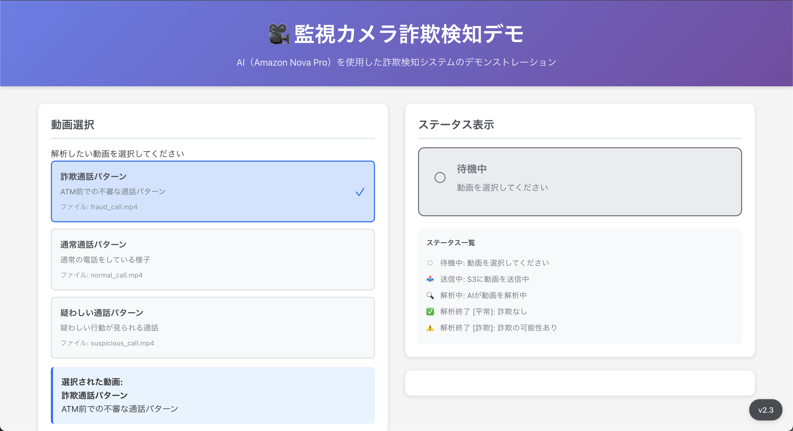
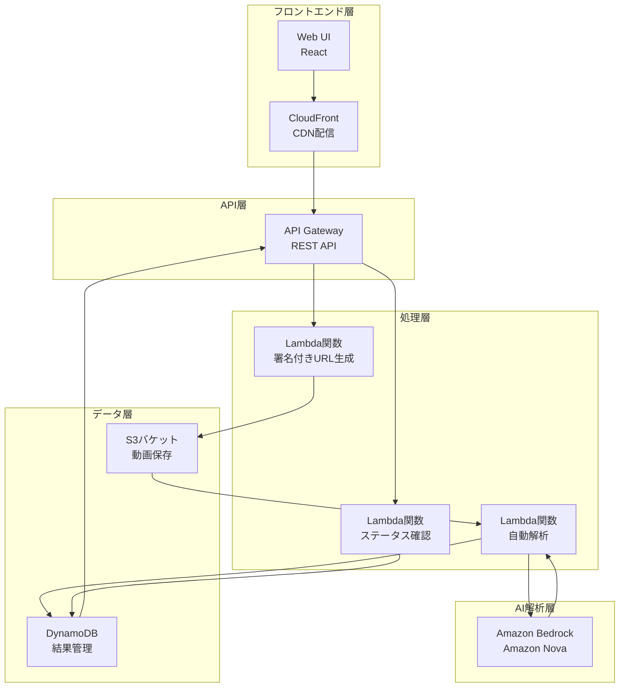
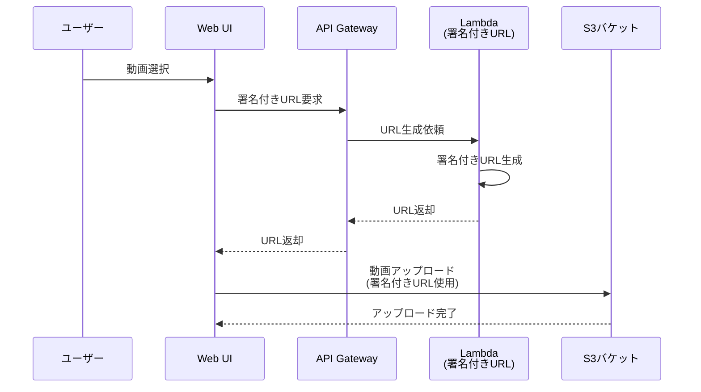
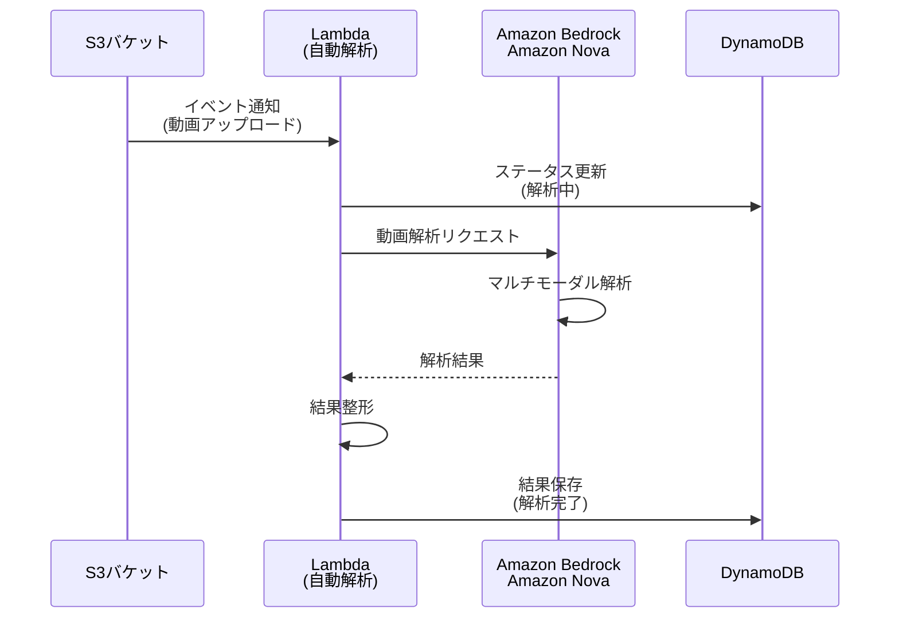
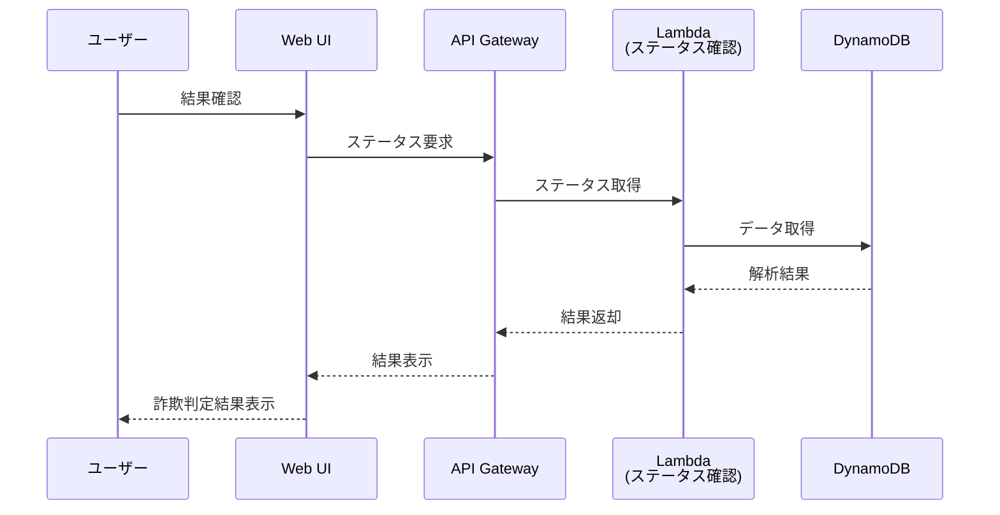

# 金融機関における生成 AI 活用ユースケース：ATM 不正検知（高齢者電話利用）

## 1. ユースケース概要

金融機関の ATM コーナーや窓口における詐欺被害を未然に防ぐため、監視カメラ映像を AI（Amazon Nova）で動画のまま解析し、詐欺の可能性がある行動パターンを自動検知するシステムです。このデモはサンプルのため、動画のアップロードを手動で行いますが、本番構築の際は ATM 備え付けの監視カメラからのリアルタイム検知を想定しています。

### 主な特徴

本システムは、Amazon Nova のマルチモーダル機能を活用し、映像と音声を統合的に分析します。詐欺パターンを識別して警告を発することで、24 時間体制の監視を実現し、人的監視の負担を大幅に軽減します。また、詐欺手口の進化に対応するため、継続的なパターン学習機能を備えています。

このシステムは、振り込め詐欺や特殊詐欺による金銭的被害を防止することが最大の目的です。人的監視では限界がある網羅的な監視を実現し、被害発生前の段階で顧客を保護します。さらに、詐欺パターンをデータ化することで、傾向分析と対策立案を可能にします。

## 2. ユースケースの具体例

### ATM での通話検知による詐欺防止

本システムは、ATM コーナーで携帯電話を使用しながら ATM を操作している高齢者を検知することに特化しています。振り込め詐欺の典型的なパターンとして、犯人が電話で指示を出しながら被害者に ATM 操作をさせるケースが多く報告されています。

システムは監視カメラ映像から、高齢者が ATM の前で携帯電話を使用している状況を検知します。さらに、長時間の通話、焦りや困惑の表情、複数回の操作やり直し、高額出金操作といった複合的な行動パターンを分析し、詐欺の可能性を判定します。

検知された場合、システムは即座に店舗スタッフに通知を送り、スタッフが顧客に声をかけることで詐欺被害を未然に防ぎます。これにより、振り込め詐欺の予防、被害額の削減、顧客保護の強化を実現します。

一方で、正常な顧客行動（短時間の通話、落ち着いた様子、スムーズな操作）は適切に識別し、誤検知を最小限に抑えることで、業務効率を維持しながら顧客体験の向上を図ります。

## 3. 金融機関での導入メリット

### 顧客保護の強化

営業時間外も含めた 24 時間体制の継続的な詐欺検知により、いつでも顧客を守ることができます。AI による迅速な異常検知で被害を未然に防止し、特に詐欺被害に遭いやすい高齢者への重点的な保護を実現します。

### 業務効率化

監視業務を自動化することで、人員を高度な判断業務に集中させることができます。リアルタイム検知により即座の対応判断が可能になり、AI による網羅的な監視で人的ミスを削減します。

### リスク管理の向上

詐欺パターンをデータ化することで、傾向分析と対策立案が可能になります。AI による客観的な検知により判断のばらつきを解消し、検知時の映像・データを自動記録することで事後対応を強化します。

### コンプライアンス対応

AI 判断の根拠を明示することで、対応の妥当性を説明できます。検知履歴と対応記録を体系的に管理し、監査に対応します。検知精度の定期的な評価と改善により、継続的な品質向上を図ります。

## 4. 使用方法

### 基本フロー

システムの利用は 4 つのステップで構成されます。まず、監視カメラ映像を自動的に S3 にアップロードするか、手動で動画ファイルを選択してアップロードします。次に、Amazon Nova による自動解析が開始され、映像・音声の統合分析と行動パターンの識別が行われます。

解析が完了すると、詐欺の可能性レベル（高・中・低）、検出された行動パターンの詳細、推奨アクションが表示されます。高リスクが検知された場合は即座に通知され、職員による顧客への声かけや、必要に応じた警察への通報を促します。

### Web UI 画面構成

動画選択画面では、サンプル動画の選択、動画プレビューが可能です。解析中画面では、リアルタイムでステータスが更新され、進捗インジケーターと処理時間が表示されます。結果表示画面では、詐欺可能性の判定結果（高・中・低）、検知された行動パターンのリスト、信頼度スコア（0-100%）、推奨アクションが提示されます。

## 5. システム構成・技術要素

### アーキテクチャ概要

本システムは、サーバーレスアーキテクチャを採用し、スケーラビリティと運用効率を両立しています。フロントエンド層、API 層、処理層、AI 解析層、データ層の 5 層構造で構成され、各層が疎結合に連携することで、柔軟な拡張と保守を可能にしています。

### 使用 AWS サービス

- **Amazon Bedrock (Amazon Nova)** - マルチモーダル AI による映像解析
- **Amazon S3** - 動画ファイルの保存
- **AWS Lambda** - サーバーレス処理（署名付き URL 生成、AI 解析トリガー、結果取得）
- **Amazon DynamoDB** - 解析結果とメタデータの管理
- **Amazon API Gateway** - REST API エンドポイント
- **Amazon CloudFront** - Web アプリケーションの配信

システムの中核となるのは、Amazon Bedrock 上で動作する Amazon Nova です。このマルチモーダル AI が映像解析エンジンとして機能し、詐欺パターンの識別と判断根拠の生成を担当します。

監視映像は Amazon S3 に保存され、ライフサイクル管理により適切に管理されます。AWS Lambda は 3 つの関数で構成され、署名付き URL の生成、自動解析のトリガー、ステータス管理を担当します。解析結果は Amazon DynamoDB に保存され、高速な読み書きを実現しています。

ユーザーインターフェースは、Amazon CloudFront を通じて配信され、低レイテンシでのアクセスを提供します。API Gateway が REST API エンドポイントを提供し、認証・認可とレート制限を管理します。

### システムフロー

#### 動画アップロードフロー

ユーザーが Web UI で動画を選択すると、システムは API Gateway 経由で Lambda 関数を呼び出し、S3 への署名付き URL を生成します。この署名付き URL には 5 分間の有効期限が設定されており、セキュアな直接アップロードを実現します。動画はユーザーのブラウザから直接 S3 にアップロードされるため、API Gateway のペイロード制限を回避できます。

#### AI 解析フロー

S3 への動画アップロードが完了すると、イベント通知が自動解析 Lambda 関数をトリガーします。Lambda 関数はまず DynamoDB のステータスを「解析中」に更新し、その後 Amazon Bedrock 経由で Amazon Nova に動画解析をリクエストします。Amazon Nova はマルチモーダル解析を実行し、映像と音声から詐欺パターンを識別します。解析結果は Lambda 関数で整形され、DynamoDB に保存されます。

#### 結果取得フロー

ユーザーが Web UI で結果を確認すると、ステータス確認 Lambda 関数が DynamoDB から解析結果を取得し、API Gateway 経由でフロントエンドに返却します。フロントエンドは詐欺判定結果、検出パターン、推奨アクションを視覚的に表示します。

### データモデル

DynamoDB には解析結果テーブルを配置し、videoId をパーティションキー、timestamp をソートキーとして設計しています。各レコードには、動画 ID、解析実行時刻、ステータス、詐欺可能性レベル、信頼度スコア、検出パターン配列、推奨アクション配列、詳細分析結果、S3 オブジェクトキー、作成・更新日時が含まれます。

### API 仕様

システムは 2 つの主要な API エンドポイントを提供します。

署名付き URL 取得エンドポイント（GET /presigned-url）は、動画ファイル名と MIME タイプをクエリパラメータとして受け取り、S3 への署名付きアップロード URL、動画 ID、有効期限（300 秒）を返却します。

ステータス確認エンドポイント（GET /status/{videoId}）は、指定された動画 ID の解析結果を返却します。レスポンスには、動画 ID、ステータス、詐欺可能性レベル、信頼度スコア、検出パターン配列、推奨アクション配列、タイムスタンプが含まれます。

## 6. 運用・監視

### モニタリング戦略

CloudWatch Metrics でシステムの各種メトリクスを収集し、CloudWatch Logs で全てのログを集約します。CloudWatch Alarms で異常を検知し、SNS 経由で運用チームに通知します。これらの情報は統合ダッシュボードで可視化され、システムの健全性を一目で把握できます。

監視項目には、Lambda 実行時間とエラー率、API Gateway のレイテンシとエラー率、DynamoDB の読み書きキャパシティ、S3 のストレージ使用量、Bedrock API の呼び出し回数とエラーが含まれます。

アラートは、Lambda 関数のエラー率が 5%を超えた場合、API Gateway の 5xx エラーが発生した場合、DynamoDB のスロットリングが発生した場合、Bedrock API の呼び出しが失敗した場合に発報されます。

### コスト最適化

主なコストは Amazon Bedrock（Amazon Nova）の動画解析コスト、Lambda の実行時間に応じた課金、S3 のストレージとデータ転送、DynamoDB のオンデマンドキャパシティ、CloudFront のデータ転送量、API Gateway のリクエスト数となります。

コスト削減のため、S3 ライフサイクルポリシーで古い動画を自動削除し、CloudFront キャッシュを最適化します。Lambda 関数の実行時間を最適化し、DynamoDB の TTL 設定で不要なデータを自動削除します。

## 7. 参考情報

### 関連ドキュメント

- [Amazon Nova Documentation](https://docs.aws.amazon.com/nova/)
- [Amazon Bedrock User Guide](https://docs.aws.amazon.com/bedrock/latest/userguide/)
- [AWS Lambda Best Practices](https://docs.aws.amazon.com/lambda/latest/dg/best-practices.html)
- [Terraform AWS Provider](https://registry.terraform.io/providers/hashicorp/aws/latest/docs)

### ソースコード

本プロジェクトは近日中に公開予定です。

### サポート・問い合わせ

技術的な質問や問題が発生した場合は、公開後に GitHub Issues をご利用ください。
