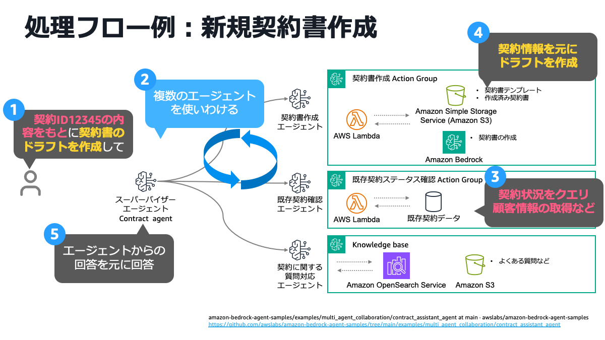
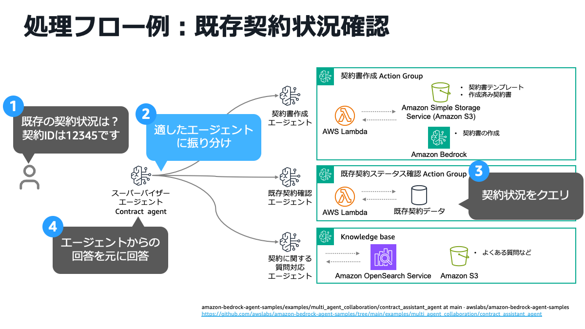
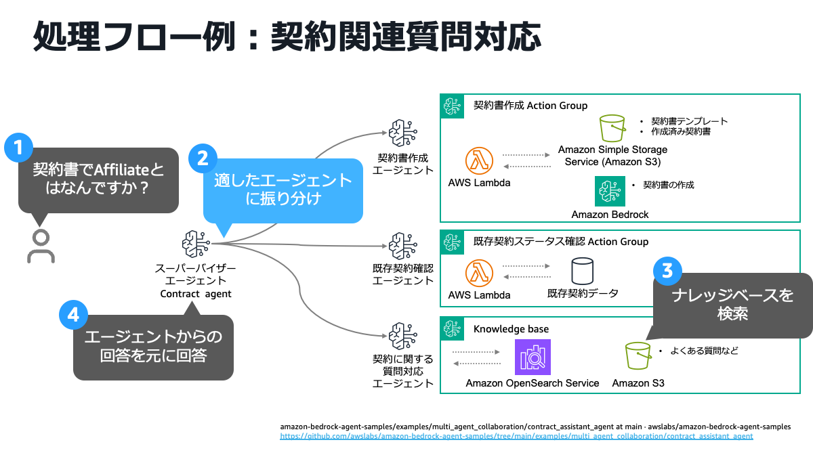
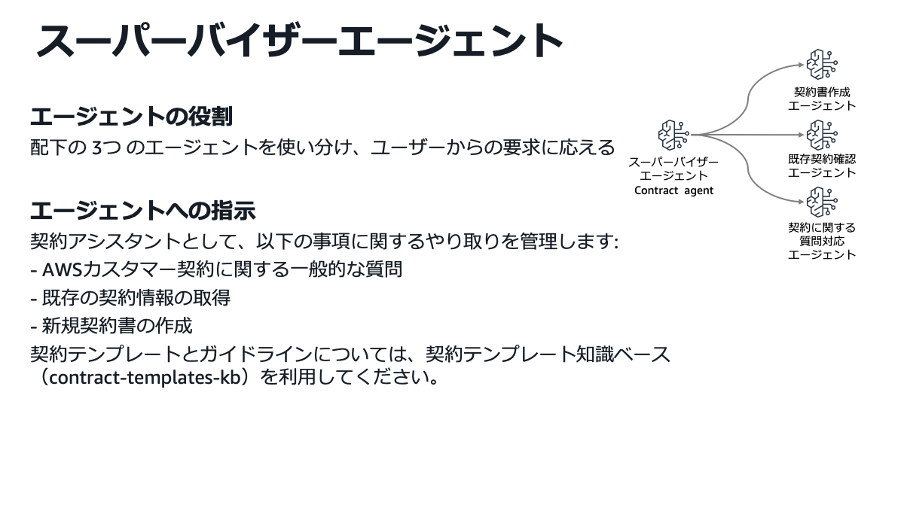
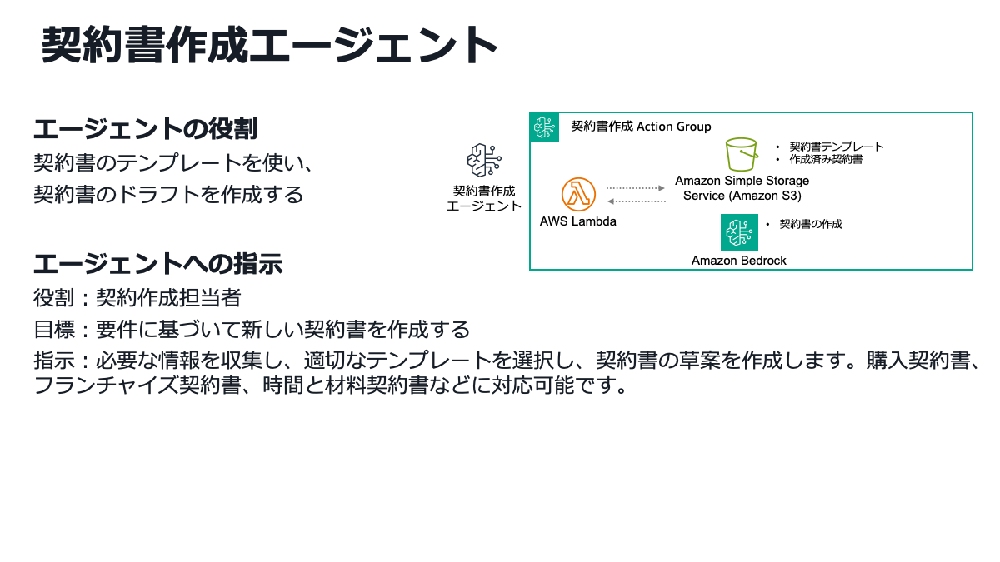
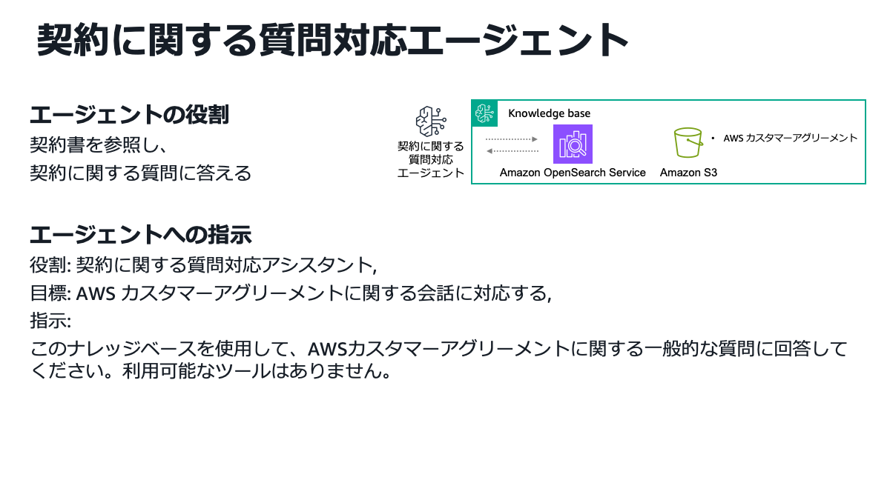

# 金融機関における生成 AI 活用ユースケース: 契約書業務アシスタント

## 1. ユースケース概要

契約書関連業務を包括的に支援する AI アシスタントシステムです。法務担当者や営業担当者は、自然言語での問い合わせやリクエストを通じて、**契約書の新規作成**、**既存契約の照会・確認**、**契約に関する質問への回答**を迅速に行うことができます。

複数の専門 AI エージェントが連携して動作し、ユーザーの要求を自動的に適切なエージェントに振り分けることで、複雑な契約業務を効率化します。テンプレートベースの契約書作成、既存契約データベースへのアクセス、契約に関するナレッジベース検索を、一つのインターフェースから利用できます。

### 主な特徴

- **統合されたインターフェース**: 契約書作成、照会、質問対応を一つのシステムで処理
- **自然言語での操作**: 専門知識がなくても、日常的な言葉で操作可能
- **自動タスク振り分け**: ユーザーの要求内容に応じて、最適なエージェントが自動選択
- **複数エージェントの連携**: 複雑なタスクも、複数のエージェントが協調して処理

## 2. ユースケースの具体例

| ユースケース名       | 対象者                         | 目的・目標                                                                                                             | 主要な機能                                                   | 期待効果                                                     |
| -------------------- | ------------------------------ | ---------------------------------------------------------------------------------------------------------------------- | ------------------------------------------------------------ | ------------------------------------------------------------ |
| **新規契約書作成**   | 法務担当者、営業担当者         | 顧客情報や契約形態の入力のみで、契約書のテンプレートをベースに AI エージェントが契約書を作成することによる作業負荷軽減 | ・適切なテンプレート選択 ・要件に基づく自動生成        | ・作成時間の短縮 ・品質の標準化                        |
| **既存契約状況確認** | 営業担当者、カスタマーサポート | 自然言語で既存の契約状況の問い合わせが可能になり、契約情報の迅速な照会と回答を実現                                     | ・契約 ID による検索 ・ステータス確認 ・詳細情報の提供 | ・問い合わせ対応の迅速化 ・顧客満足度向上 ・業務効率化 |
| **契約関連質問対応** | 全社員                         | 既存契約書やよくある質問をナレッジベースとすることで、自然言語での契約に関する質問とその回答を実現                     | ・ナレッジベース検索 ・契約に関する情報提供               | ・専門知識の組織的活用 ・回答品質の向上                |

## 3. 金融機関での導入メリット

### 業務効率化

- **24 時間対応**: 時間制約のない契約関連業務の処理
- **自動化による効率向上**: 手作業による契約書作成・確認作業の削減

### 品質向上

- **一貫した品質**: テンプレートベースによる標準化された契約書作成
- **専門知識の活用**: ナレッジベースを通じた組織的な知識共有

### コスト削減

- **人件費削減**: 契約関連業務の自動化による工数削減
- **迅速な対応**: 問い合わせ対応時間の短縮による機会損失回避

## 4. 使用方法

本システムは、Web インターフェースまたはプログラマティックに利用できます。ユーザーは自然言語で契約に関する質問や依頼を入力するだけで、スーパーバイザーエージェントが適切なサブエージェントにタスクを振り分け、回答を返します。

### 処理フロー例：新規契約書作成

新規契約書作成の処理フローを図に示します。ユーザーが既存の契約情報を参照した上で、新しい契約書のドラフト作成を依頼すると、スーパーバイザーエージェントが複数のエージェントを協調させ、既存契約確認エージェントが既存の契約情報を確認した上で、その情報をもとに契約書作成エージェントが契約テンプレートを利用して契約書のドラフトを生成する複合的な処理を実行します。

① ユーザーが既存の契約 ID を指定して、参考にすべき情報を明示し、契約書のドラフト作成を依頼する
② スーパーバイザーエージェントが適したサブエージェントを選択し、それぞれのエージェントにタスクを振り分ける
③ 既存契約確認エージェントはユーザーからの契約 ID をもとに既存契約データから契約状況を取得する
④ 契約書作成エージェントが、既存契約確認エージェントが取得した契約情報をもとに契約書のドラフトを作成する
⑤ サブエージェントからの回答をもとにユーザーに最終的な回答を行う

### 処理フロー例：既存契約状況確認

既存契約状況確認の処理フローを図に示します。ユーザーが既存の契約 ID を自然言語で問い合わせると、スーパーバイザーエージェントが既存契約確認エージェントにタスクを振り分けます。既存契約確認エージェントは、既存契約データにクエリを送信し、契約情報を把握した上で、スーパーバイザーエージェントを介してユーザーに契約情報を自然言語で回答します。

① ユーザーが既存の契約 ID をもとに、既存の契約状況を問い合わせる
② スーパーバイザーエージェントが既存契約確認エージェントに振り分け
③ 既存契約確認エージェントは既存契約データに対してクエリを行い、回答を生成
④ スーパーバイザーエージェントが既存契約確認エージェントからの回答をもとにユーザーに最終回答を送信

### 処理フロー例：契約関連質問対応

契約関連質問対応の処理フローを図に示します。ユーザーが契約に関する質問を自然言語で問い合わせると、スーパーバイザーエージェントが契約に関する質問対応エージェントにタスクを振り分けます。契約に関する質問対応エージェントは、よくある質問などが格納されたナレッジベースを検索し、検索結果を踏まえてスーパーバイザーエージェントを介してユーザーに質問の回答を自然言語で回答します。

① ユーザーが契約に関する質問を行う
② スーパーバイザーエージェントが契約に関する質問対応エージェントに振り分け
③ 契約に関する質問対応エージェントはよくある質問などが格納されたナレッジベースを検索し、回答を生成
④ スーパーバイザーエージェントが契約に関する質問対応エージェントからの回答をもとにユーザーに最終回答を送信

### サンプルプロンプト

以下のようなプロンプトに対応することができます。

- "契約 ID 12345 の契約状況を教えてください。"
- "新しいサービス契約書のドラフトを作成してください。"
- "契約書で Affiliate とはなんですか？"

## 5. システム構成・技術要素

図は、契約書業務アシスタントシステムのエージェントの構成を示しています。ユーザーからの問い合わせを受けるスーパーバイザーエージェントが、3 つの専門エージェント（契約書作成、既存契約確認、契約関連質問対応）に内容に応じてルーティングする構成となっています。各エージェントは Amazon Bedrock でホスティングされる LLM を活用し、既存の契約書データ、契約テンプレート、契約に関するナレッジベースを利用して割り振られたタスクを完遂します。

システムは以下の 4 つの主要エージェントで構成されています：

### 1） スーパーバイザーエージェント (Contract Agent)

スーパーバイザーエージェントは、ユーザーからの多様な契約関連の問い合わせを受け取り、内容を分析して最適な専門エージェントに振り分けるコントロール機能と最終的な回答の作成を担います。Amazon Bedrock のマルチエージェントコラボレーション機能により、割り振るエージェントの識別と、各エージェントからの回答の収集と最終的な回答の作成を行っています。

**役割**:
配下の 3 つのエージェントを使い分け、ユーザーからの要求に応える。

**管理する業務**:
契約に関する一般的な質問はスーパーバイザーエージェントが回答する。また、各サブエージェントが担うタスクは、各サブエージェントへタスクの振り分けを行う。

### 2） 契約書作成エージェント

契約書作成エージェントは、スーパーバイザーエージェントからの契約書作成に関するタスクを受領し、適切な契約テンプレートを選択し、Amazon Bedrock の LLM を使用して新規契約書のドラフトを自動生成します。生成された契約書は S3 に保存され、ユーザーに提供されます。サンプルでは、契約テンプレートとして、購入契約書、フランチャイズ契約書、タイムアンドマテリアル契約書のサンプルが格納されています。

**役割**:
契約書のテンプレートを使い、契約書のドラフトを作成する

**機能**:
要件に基づいて、適切なテンプレートを選択し、新しい契約書を作成する

### 3） 既存契約確認エージェント

既存契約確認エージェントは、ユーザーから既存の契約 ID や契約に関する問い合わせを受け取り、既存の契約データにアクセスして契約状況やステータスを照会します。AWS Lambda を通じて、契約の詳細情報や現在の状況を回答します。

**役割**:
既存の契約状況を確認し応答する。

**機能**:
既存契約に関する、契約のステータスや詳細情報の照会と回答を行う。

### 4） 契約に関する質問対応エージェント

契約に関する質問対応エージェントは、ナレッジベースに格納された契約に関する情報（例えば、よくある質問など）をもとに、契約に関する質問に回答します。ナレッジベースとして利用している Amazon OpenSearch Service を利用し、検索と適切な回答の生成を行います。

**役割**:
契約に関する情報を参照し、契約に関する質問に答える

**機能**:
ナレッジベースを使用し、契約に関する質問へ回答する

## 6. デプロイ方法

以下のレポジトリにデプロイ方法が記載されています。

[Amazon Bedrock Agent Samples - Contract Assistant Agent](https://github.com/awslabs/amazon-bedrock-agent-samples/tree/main/examples/multi_agent_collaboration/contract_assistant_agent)

## 7. 参考情報

### 関連リソース

- [Amazon Bedrock Agent Samples - Contract Assistant Agent](https://github.com/awslabs/amazon-bedrock-agent-samples/tree/main/examples/multi_agent_collaboration/contract_assistant_agent)
- [Amazon Bedrock Agents Documentation](https://docs.aws.amazon.com/bedrock/latest/userguide/agents.html)
- [Multi-Agent Collaboration Documentation](https://docs.aws.amazon.com/bedrock/latest/userguide/agents-multi-agent-collaboration.html)
