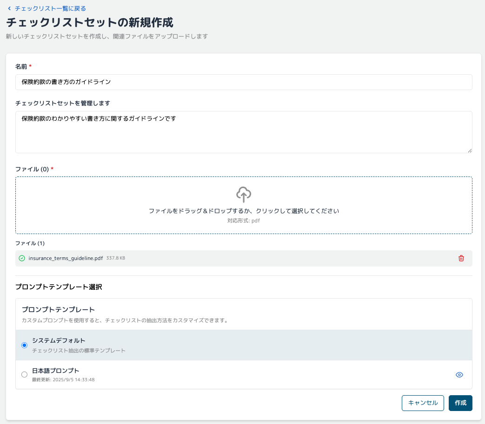
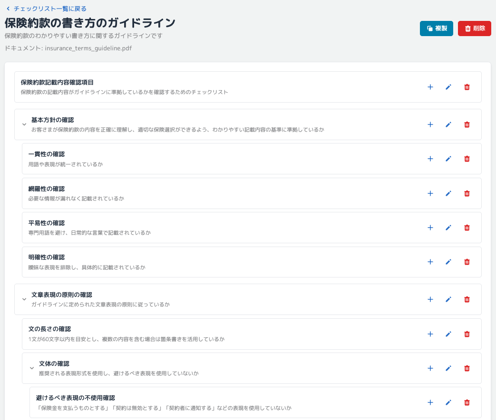
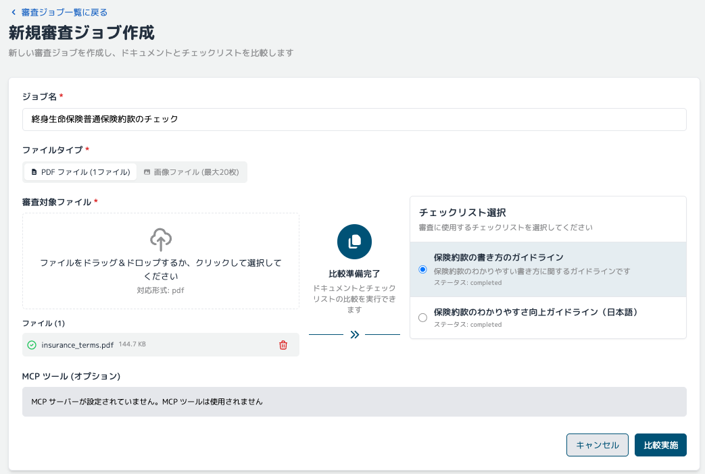
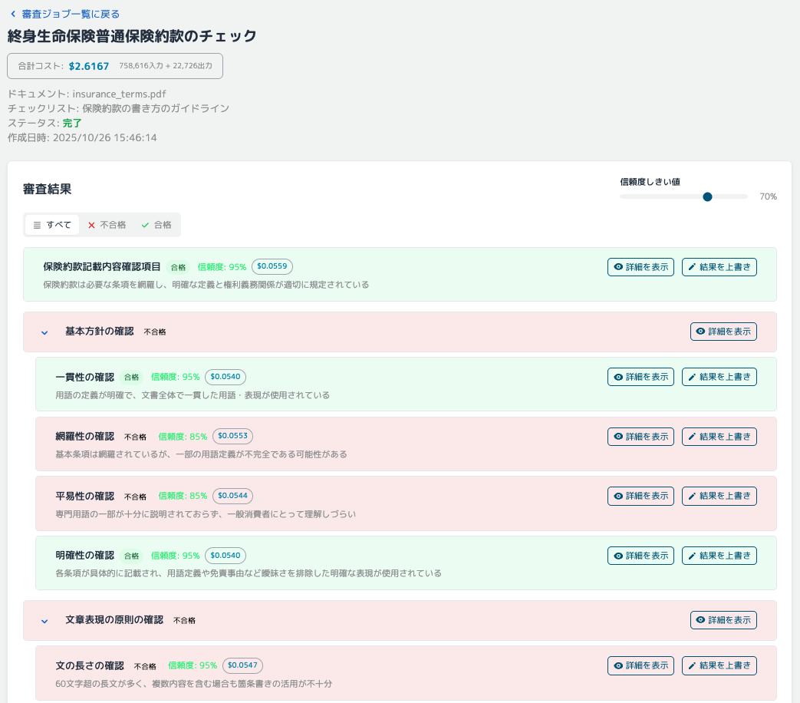
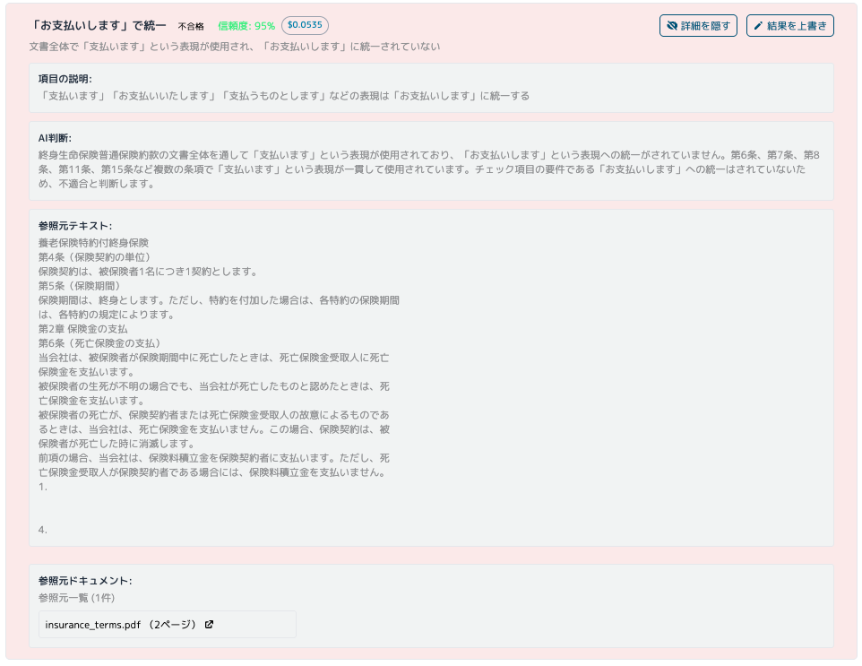

# 金融機関における生成 AI 活用ユースケース：文書・コンテンツ審査

## 1. ユースケース概要

RAPID (Review & Assessment Powered by Intelligent Documentation) は、Amazon Bedrock を活用した生成 AI 書類審査ソリューションです。金融機関における膨大な文書審査業務を、AI と人間の協働（Human in the Loop）で効率化します。

**利用方法は 3 ステップ**で非常にシンプルです：

1. **審査基準となるガイドライン文書をアップロード** → AI が自動的にチェックリストを生成
2. **審査対象の文書をアップロード** → AI が生成したチェックリストに基づいて自動審査
3. **審査結果を確認** → 人間が最終判断を行い、必要に応じて修正指示

担当者は、複雑な審査基準を理解していなくても、ガイドライン文書をシステムに渡すだけで、AI が自動的にチェック項目を抽出し、審査を実行します。AI の判断根拠も明示されるため、説明責任を確保しながら、審査時間の短縮と品質向上を同時に実現できます。

### 主な特徴

- **ガイドラインからチェックリストを自動生成**: 審査基準書をアップロードするだけで、AI が確認すべき項目を自動抽出
- **大量文書の自動審査**: 生成 AI による高速かつ網羅的な文書審査
- **判断根拠の透明性**: AI がなぜそう判断したのか、根拠を明示
- **人間と AI の協調**: AI による一次審査と人間による最終確認の組み合わせで、効率と品質を両立

## 2. 文書審査ユースケースの具体例

| 審査基準の種類               | 対象文書例                                       | 適用基準例                                     |
| ---------------------------- | ------------------------------------------------ | ---------------------------------------------- |
| **法令・規制ガイドライン**   | 金融商品広告、募集文書、開示書類                 | 金融庁監督指針、業界団体自主規制規則           |
| **社内コンプライアンス規程** | 営業資料、顧客提案書、社外発表資料               | 社内コンプライアンスマニュアル、リスク管理規程 |
| **ブランドガイドライン**     | マーケティング資料、Web コンテンツ、広告素材     | 企業ブランドガイドライン、デザインスタンダード |
| **品質管理基準**             | 顧客向けマニュアル、FAQ、サポート資料            | 品質管理規程、文書作成ガイドライン             |
| **情報セキュリティポリシー** | 顧客情報取扱文書、システム仕様書、外部委託契約書 | 情報セキュリティポリシー、個人情報保護規程     |
| **業界ベストプラクティス**   | ESG 報告書、サステナビリティレポート、統合報告書 | GRI スタンダード、TCFD 提言、SASB 基準         |

## 3. 金融機関での導入メリット

### 審査業務の効率化

- **審査時間の短縮**: 手作業による文書審査の時間とコストを削減
- **24 時間対応**: 時間制約なく審査を実行可能
- **人的リソースの最適化**: 定型的な審査作業を AI に任せ、高度な判断業務に集中

### 品質向上

- **品質の標準化**: 審査者による判断のばらつき解消
- **一貫した審査基準**: 人的ばらつきの排除
- **見落とし防止**: 網羅的なチェック実行により審査品質向上
- **判断根拠の明確化**: AI による透明性の高い審査

### コスト削減

- **人件費削減**: 審査業務の自動化
- **迅速な市場投入**: 審査期間短縮による機会損失回避
- **再審査コストの削減**: 初回審査の精度向上

## 4. 使用方法

### 基本的な利用フロー

#### ステップ 1: チェックリストの作成

1. RAPID の Web UI のチェックリストセット一覧画面にアクセスし、「新規作成」を選択します。

2. 審査基準となるガイドラインや規程文書（PDF）をアップロードします。

   

3. AI が文書を解析し、審査項目を自動抽出して構造化されたチェックリストを生成します。

   

4. 生成されたチェックリストを確認し、必要に応じて項目の追加・修正・削除を行います。

#### ステップ 2: 文書の審査

1. 審査ジョブ一覧画面にアクセスし、「新規ジョブ作成」を選択します。

1. 審査したい文書（PDF、画像）をアップロードします。

1. 適用するチェックリストを選択します。

1. 「比較実施」ボタンをクリックすると、システムが自動的に文書を解析し、チェックリストの各項目について審査を実行します。

   

#### ステップ 3: 結果の確認と承認

1. 審査が完了すると、結果画面が表示されます。各項目の合否判定と AI の判断根拠を確認できます。

   

2. 不合格項目がある場合は、詳細な理由と該当箇所が表示されます。

   

3. 人間が最終確認と承認を行い、必要に応じて修正指示や再審査を実施します。

## 5. システム構成・技術要素

### RAPID (Review & Assessment Powered by Intelligent Documentation)

**GitHub**: [aws-samples/review-and-assessment-powered-by-intelligent-documentation](https://github.com/aws-samples/review-and-assessment-powered-by-intelligent-documentation)

RAPID は、Amazon Bedrock を活用した生成 AI 書類審査ソリューションです。GitHub で公開されているオープンソースソリューションで、生成 AI による文書審査の自動化を実現します。

### 使用 AWS サービス

- **Amazon Bedrock**: 生成 AI による文書解析と審査
- **AWS Lambda**: サーバーレス処理
- **Amazon S3**: 文書の保存と管理
- **Amazon DynamoDB**: チェックリストと審査結果の管理
- **Amazon CloudFront**: Web UI の配信

### 主要機能

**チェックリスト自動生成**

- ガイドライン文書から審査項目を自動抽出
- 構造化されたチェックリストの生成

**AI 文書審査**

- Amazon Bedrock による文書解析
- チェックリストに基づく自動審査
- 合否判定と判断根拠の提示

**審査結果管理**

- 審査結果の保存と履歴管理

**Web インターフェース**

- ブラウザベースの操作画面
- 文書アップロードと審査実行
- 審査結果の確認と承認

## 6. デプロイ方法

### GitHub リポジトリ

[aws-samples/review-and-assessment-powered-by-intelligent-documentation](https://github.com/aws-samples/review-and-assessment-powered-by-intelligent-documentation)

詳細なデプロイ手順はリポジトリの README を参照してください。

### 前提条件

- AWS アカウント
- AWS CLI の設定
- Amazon Bedrock へのアクセス権限

### 基本的なデプロイ手順

リポジトリのドキュメントに従ってデプロイを実行してください。通常、以下の手順が含まれます：

1. リポジトリのクローン
2. 必要な依存関係のインストール
3. AWS リソースのデプロイ
4. 環境変数の設定
5. アプリケーションの起動

## 7. 参考情報

### 関連記事・ブログ

- [AWS の書類審査ソリューション RAPID をデプロイして利用してみる - Qiita](https://qiita.com/sugimount-a/items/f5720c9d06f66e83f228)
- [AWS Summit Japan 2025 建設・不動産向けブース展示 - AWS Blog](https://aws.amazon.com/jp/blogs/news/aws-summit-2025-japan-cre-booth-and-sessions/)

### 適用可能な業界

RAPID は金融機関以外にも、以下のような業界で活用可能です：

- 建設・不動産：工事書類、安全管理文書の審査
- 製造業：品質管理文書、技術仕様書の審査
- 医療・ヘルスケア：臨床文書、規制対応文書の審査
- 公共機関：申請書類、報告書の審査
