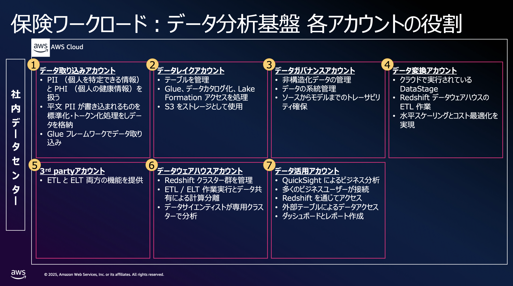
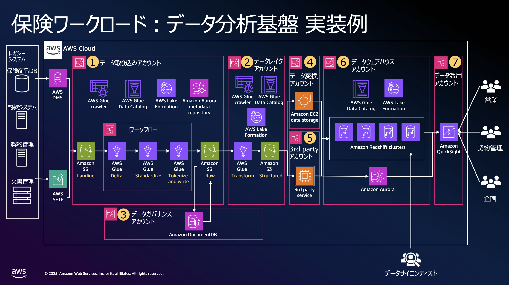

# 金融ワークロードアーキテクチャ解説 [ 保険ワークロード：データ分析基盤 ]

## アーキテクチャの特徴

### 本アーキテクチャのリファレンス

現在実際に稼働している保険会社のデータ分析基盤のアーキテクチャを参考に、保険のワークロードのデータ処理やセキュリティの要件を実現するシステムをリファレンスとしています。

#### 保険ワークロードでデータ分析基盤を実現している事例

- New York Life
- Sun Life

### 本アーキテクチャの目的

保険業務に必要なデータ処理を効率的かつ経済的に実現するデータプラットフォームを構築しています。これにより、代理店や契約者への多様なサービス提供を支える分析基盤を提供します。

#### 現状の課題

保険会社の既存オンプレミスデータプラットフォームは、データ量急増により処理能力不足とコスト増大に直面しています。レガシーシステムの機能制約により、多様化する利用者ニーズに対応できない状況となっています。また、セキュリティ境界が曖昧で、コンプライアンス要件への対応が困難であり、各処理段階での障害や変更が他システムに影響を与えるリスクが存在しています。

#### 実現したいこと

実現したいことは以下 4 点あります。

- **コスト効率的なスケーラビリティ**: データ量の変動に応じて自動的にリソースを増減し、必要な時に必要な分だけコストを支払う従量課金モデルを実現します。

- **高性能データ処理**: 大量データの高速処理と複数ユーザーからの同時アクセスに対応できる処理能力を提供します。

- **高可用性の確保**: システム障害時でも業務継続できる冗長化を実現します。

- **セキュリティとガバナンスの強化**: セキュリティ境界の明確化、コンプライアンス要件への対応、責任分離とガバナンスの強化、運用の独立性確保を実現し、各処理段階での障害や変更が他に影響しないよう、データエンジニア・アナリスト・セキュリティチームなどの役割に応じた適切なアクセス制御と権限管理を行います。

### 本アーキテクチャの特徴

- 統合データレイクを中心としたデータプラットフォームにより、保険業務における契約者情報、健康情報、財務データの取り込みから分析機能をクラウド上でシステム化しています。

- コスト効率的なスケーラビリティの実現として、マネージドサービスを活用し、データ量の変動に応じた自動スケーリングと従量課金モデルを採用しています。これにより、オンプレミス環境で発生していた固定コストと過剰プロビジョニングの課題を解決し、実際の利用量に応じた最適なコスト配分を実現します。

- 高性能データ処理の提供として、データレイクとデータウェアハウスを組み合わせた統合処理基盤により、大量データの高速処理と複数ユーザーからの同時アクセスに対応できる処理能力を確保しています。特に、自動化された ETL / ELT パイプラインでデータ変換処理の並列実行を実現しています。

- 高可用性の確保として、データレイクの自動レプリケーション、クラスターのマルチノード構成、およびジョブの自動再試行機能により、システム障害時でも業務継続できる冗長化を実現しています。

- セキュリティとガバナンスの強化として、データ取り込み、データレイク、データ変換、データウェアハウス、データ分析の処理ごとに分離されたアカウントで実行できるようにマルチアカウント戦略を導入しています。 PII / PHI データのトークン化、アカウント分離、最小権限アクセス制御の仕組みを盛り込んでいます。保険業界特有のデータプライバシー要件と規制遵守を確実に実現するためです。

### 工夫したポイント、AWS 独特の実装、Edge な取り組み

#### メタデータ駆動型データパイプライン

- Amazon Aurora メタデータリポジトリを活用し、データソースのパターンに応じて AWS Glue ジョブを自動生成する統一フレームワークを構築しています。ポイントツーポイント型の個別取り込みソリューションを排除し、 100 以上の異なるソースからの効率的なデータ取り込みを実現しています。

#### 計算分離とデータ共有

- Amazon Redshift Data Sharing により、 ETL / ELT 処理と分析処理を完全分離。データサイエンティスト用サーバーレスクラスターで本番データへの安全なアクセスを提供しながら、パフォーマンス競合を回避しています。

#### マイクロアカウント戦略とセキュリティ

- AWS Well-Architected Framework に準拠したマイクロアカウント戦略を採用しています。全データパイプライン処理により、 PII / PHI データの完全な分離を実現しています。トラストポリシーによるクロスアカウントアクセスで、侵害時の迅速な遮断を可能にしています。

### 実装しなかったこと

#### 完全な DR （災害復旧）の実装

- 分析・レポーティング用途 を重視し、リアルタイム業務システム向けの完全な DR 環境構築を見送りました。数時間の停止は許容範囲内と判断し、 年間数千万円の DR 維持コスト を他の価値創造活動に投資する選択を実施しました。AWS 標準の S3 の耐久性とマルチ AZ 配置の冗長性で十分なリスク軽減を実現しました。
- 現在のアーキテクチャでは実装していませんが、必要に応じて DR 戦略が可能です。 S3 Cross-Region Replication による分析データの地理的分散配置、 AWS Glue ETL ジョブの複数リージョン展開とメタデータリポジトリの同期、 Amazon Redshift クラスターのスナップショット自動化と他リージョンへの復元機能、 Lambda 関数と Step Functions の自動フェイルオーバー設定、 Amazon Athena / QuickSight の災害時切り替え機能を段階的に実装できます。ビジネス要件の変化に応じて、 RPO （目標復旧時点）・ RTO （目標復旧時間）を定義し、コスト対効果を評価しながら必要な範囲で DR 機能を強化する柔軟な設計が可能です。

## アーキテクチャ

### アーキテクチャ図

### 解説文

#### 基本となるアーキテクチャの説明

- Amazon S3 データレイクと Amazon Redshift によるレイクハウスアーキテクチャへの移行を実施しています。約 100 の異なるソースからデータレイクへの取り込みを行い、 AWS Glue 、 AWS Lambda 、 Amazon Redshift 等のマネージドサービスを活用しています。

- メインのメタデータリポジトリとして Amazon Aurora を採用しています。 AWS Glue フレームワークによりメタデータに基づく Glue ジョブの自動生成を実現しています。 3rd Party を使用した PII / PHI データのトークン化と LDAP グループによる権限管理を統合しています。AWS での PII 検出・マスキング実装方法としては、 AWS Glue Studio のビジュアル ETL ジョブで Detect PII transform を使用し、個人情報を自動検出することも可能です。検出パターン、閾値、サンプリング率を設定し、機密データをマスキングします。 AWS Glue DataBrew レシピと組み合わせて日付フォーマット変換も実行可能です。 AWS Glue の正規表現 ( regex ) を使用し、日本語に対応した機密データの検出エンティティを作成できます。

#### 保険業界特有のセキュリティを担保したマルチアカウント構成の説明

- 各 AWS アカウントを通じた全データパイプライン活動により、生命保険申請で扱う個人情報・機密データを完全に保護しています。データを専用アカウントに保管させ、プロセスや人々のアクセスを制限し、すべてのデータをそのアカウントから適切に管理・処理する構成にしています。

- 役割ごとに異なる権限を付与し、データ取得部分は着地バケットへの書き込みアクセス権のみ、処理部分は読み取りアクセス権のみをもっています。トラストポリシーによるクロスアカウントアクセスで、侵害時の迅速な遮断を可能にしています。

#### Data Ingestion アーキテクチャ

- 約 100 の異なるソース（ SFTP 、 DMS 、CDC 、メッセージベース等 ）からの統一的なデータ取り込みを実現するため、 Amazon Aurora メタデータリポジトリと AWS Glue フレームワークを構築しました。メタデータをロードすると Glue ジョブが自動生成される仕組みです。

- 着地バケットにはソースシステムと全く同じ状態でデータを着地させ、変換は一切実行していません。その後、統一パイプラインで 1. 独自のデルタ検出、 2. 標準化（日時形式、住所ドクター呼び出し）、 3. 3rd Party による PII / PHI トークン化を実施しています。

- データ取り込みアカウント内の Raw バケットには変更・標準化・トークン化されたデータのみを保存し、その後データレイクアカウントに変更を適用しています。構造化・非構造化データ両方に対応し、 Salesforce 、 Adobe 、 SharePoint 等からの汎用フレームワークも構築しました。

#### Data Consumption アーキテクチャ

- データレイクアカウントをエンドユーザーがデータを消費できる最初のレイヤーとして配置し、 30-40 年間の契約者履歴を [Type 2 （履歴保持）（ \*1 ）](#注釈)で維持しています。引越しの多い契約者の各住所と期間の管理を実現しています。

- データレイク全体のテーブルで約 4,000 テーブルを管理し、 Parquet 形式から Apache Iceberg 移行により利益を得られる 1,200 - 1,400 テーブルを特定しています。約 500 テーブルを Iceberg 変換することで更新や書き込み処理に対し 25 - 40 % のパフォーマンス向上を実現しました。

- データウェアハウスアカウントの Amazon Redshift Data Sharing による計算分離で、メインプロビジョニングクラスターで ETL / ELT 処理を実行し、データサイエンティスト用・分析用のサーバーレスクラスターに本番データを共有しています。 AWS Lake Formation と Redshift 外部テーブルによる権限管理を実装しています。

#### AWS の権限管理・機微情報管理

- IAM ロールベースのクロスアカウントアクセスにより、信頼関係を設定した特定のアカウントからのみリソースアクセスを許可します。最小権限の原則に基づき、必要最小限の権限のみを付与することで機微情報へのアクセスを徹底しています。
  機微情報は AWS Secrets Manager・AWS Systems Manager Parameter Store（ SecureString ）で暗号化保存し、 AWS KMS でキー管理を行います。監視として AWS CloudTrail で全 API 呼び出しを監査ログとして記録し、 AWS Config でリソース設定変更を追跡します。

## FAQ

- Q: データ処理要件はどの程度まで対応可能ですか？

  - A: データパイプラインの複雑さ、 Amazon Redshift のクエリ最適化等に依存しますが、メタデータ駆動型フレームワークにより、 100 以上の異なるソースからの効率的な取り込みを実現可能です。

- Q: なぜデータレイクに Amazon S3 を選択したのですか？

  - A: 保険業界では 30 - 40 年の長期データ保持が必要なため、 99.999999999 % ( 11 ナイン ) の耐久性と無制限のスケーラビリティを持つ S3 を選択しました。コストと管理性を考慮し、 Amazon Redshift Spectrum との組み合わせで分析性能も確保しています。

- Q: 各アカウントでのデータ永続性はどう担保していますか？
  - A: Amazon S3 のマルチ AZ レプリケーション、 3rd Party のサービスによるトークン化、 AWS Lake Formation での権限管理を活用し、 PII / PHI データの完全保護と AZ 障害時のデータロストを最小限に抑えています。

## リファレンス

- 公開事例のリンク

  - [AWS re:Invent 2024 - New York Life: Data platform modernization to generative AI innovation ( FSI324 )](https://www.youtube.com/watch?v=aGbNFwI0-ko)
  - [How AI Transformed New York Life's Customer Service Quality](https://www.youtube.com/watch?v=qpGy9Utd0xc)
  - [Sun Life Securely Answers 10,000+ Queries Each Week Using Amazon Bedrock](https://aws.amazon.com/jp/solutions/case-studies/sun-life-case-study/)

- AWS ドキュメント、blog へのリンク
  - [マルチアカウント環境におけるベストプラクティス](https://docs.aws.amazon.com/ja_jp/organizations/latest/userguide/orgs_best-practices.html)
  - [AWS Glue を使用した個人情報の検出・マスキング・編集および Amazon OpenSearch Service へのロード](https://aws.amazon.com/jp/blogs/news/detect-mask-and-redact-pii-data-using-aws-glue-before-loading-into-amazon-opensearch-service/)
  - [How JPMorgan Chase built a data mesh architecture to drive significant value to enhance their enterprise data platform](https://aws.amazon.com/jp/blogs/big-data/how-jpmorgan-chase-built-a-data-mesh-architecture-to-drive-significant-value-to-enhance-their-enterprise-data-platform/)
  - [Enforce fine-grained access control on data lake tables using AWS Glue 5.0 integrated with AWS Lake Formation](https://aws.amazon.com/jp/blogs/big-data/enforce-fine-grained-access-control-on-data-lake-tables-using-aws-glue-5-0-integrated-with-aws-lake-formation/)
  - [Build Secure Data Mesh with AWS and Partner Solutions](https://aws.amazon.com/jp/blogs/industries/build-secure-data-mesh-with-aws-and-partner-solutions/)

## 注釈

- \*1：slowly changing dimension （ SCD ）に関する補足
  - ディメンションテーブルのレコードは、時間の経過とともに徐々に変化していくことがあります。例えば、顧客の住所は変化します。この事象を slowly changing dimension ( SCD ) と呼びます。しばしばレポーティングのために、顧客の住所の変化があったという事実を記録しておく必要があります。このような SCD を管理する方法として、Type 1 から Type 7 の方法から選択できます。Type 0 は日付など、ディメンションの変化がないときの場合に適用されます。最も一般的に使用されるのが以下の Type 1 , 2 , 3 です。
    - Type 1 （ 履歴なし ） – ディメンションテーブルは常に最新のバージョンで、履歴は保持しない
    - Type 2 （ 履歴保持 ） – 全ての変更は記録され、日付とフラグで追跡される
    - Type 3 （ 直前の値 ） – 最新から 1 つ古い属性の値が、別の属性として管理される
  - [Amazon Redshift で slowly changing dimension を実装する](https://aws.amazon.com/jp/blogs/news/implement-a-slowly-changing-dimension-in-amazon-redshift/)
  - [Slowly changing dimension](https://en.wikipedia.org/wiki/Slowly_changing_dimension)
  - [Design Tip #152 Slowly Changing Dimension Types 0, 4, 5, 6 and 7](https://www.kimballgroup.com/2013/02/design-tip-152-slowly-changing-dimension-types-0-4-5-6-7/)
