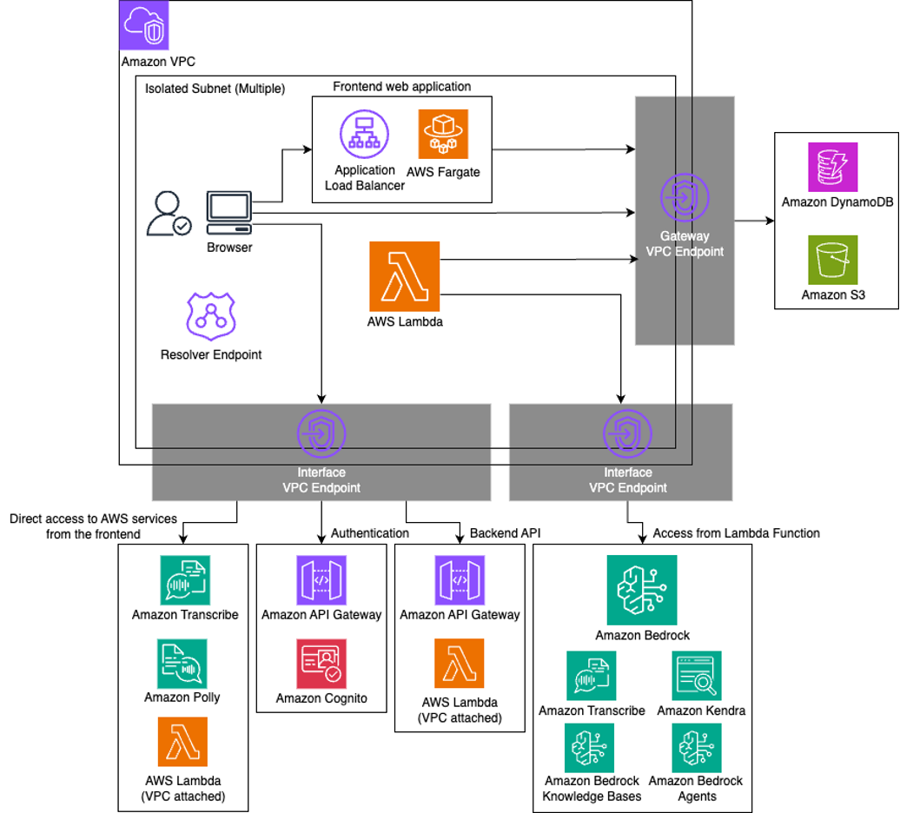

# 金融ワークロードアーキテクチャ解説 [生成 AI]

## 本リファレンスアーキテクチャの目的

本リファレンスアーキテクチャは、金融機関における生成 AI 活用のためのサンプル実装です。AWS Samples で公開されている生成 AI アプリケーション「[Generative AI Use Cases (GenU)](https://github.com/aws-samples/generative-ai-use-cases)」の閉域版をベースに、金融機関で求められるセキュリティ要件に対応するためのカスタマイズを施しています。

本リファレンスアーキテクチャでは以下を提供します：

- GenU で実現可能な金融機関向けユースケースの整理
- GenU 閉域版の主要機能と活用方法の解説
- セキュリティ強化のためのカスタマイズ内容（暗号化、監査ログ、Guardrail 設定など）
- FISC 安全対策基準への対応状況（[FISC マッピング](./fisc-mapping-genai.md)を参照）

## 前提条件

- 本サンプル実装は、GenU の[閉域版](https://github.com/aws-samples/generative-ai-use-cases/blob/main/docs/ja/CLOSED_NETWORK.md)をベースに、金融機関のセキュリティ要件に対応するためのカスタマイズを施したものです
- GenU は、チャット、文章生成、要約、翻訳、RAG、画像生成、動画生成など、多様な生成 AI ユースケースを提供するオープンソースアプリケーションです
- 閉域ネットワーク構成は組織のネットワークポリシーに応じた選択肢の一つです。通常版の GenU も十分なセキュリティ機能を備えており、要件に応じて選択可能です

## ユースケース

金融機関における生成 AI の活用は、業務効率化と顧客体験向上の両面で期待されています。GenU で実現可能な主なユースケースは以下の通りです。

### 社内ナレッジの検索・活用

金融機関には膨大な規程、マニュアル、過去の稟議書、商品説明資料などが蓄積されています。RAG（Retrieval-Augmented Generation）機能を活用することで、これらの情報を自然言語で検索し、必要な知識を素早く引き出すことができます。例えば、「新規口座開設時の本人確認手続きは？」といった問いに対して、関連する規程を参照しながら正確な回答を得ることが可能です。

### 文書作成支援

稟議書、報告書、お客様向けの説明資料、社内メールなど、金融機関の業務では多様な文書作成が求められます。生成 AI を活用することで、テンプレートに沿った文書の下書き作成や、既存文書の改善提案を受けることができ、文書作成にかかる時間を大幅に削減できます。

### 顧客対応支援

お客様からの問い合わせ内容の要約、回答案の作成、過去の類似事例の検索など、顧客対応業務において生成 AI が有用です。オペレーターの対応品質を向上させ、応答時間の短縮にも貢献します。

### データ分析支援

営業データや市場データの傾向分析、レポートの要約、データから得られる示唆の抽出など、データ分析業務においても生成 AI が活用できます。特に、大量のテキストデータから重要な情報を抽出するタスクにおいて効果を発揮します。

### 社内コミュニケーション効率化

会議の議事録自動生成、複数言語間の翻訳、社内向け資料の要約など、日常的な業務コミュニケーションの効率化にも活用できます。特に議事録生成機能は、音声録音から自動的に議事録を作成することで、会議後の作業負担を軽減します。

### その他の活用シーン

画像生成機能を活用したプレゼンテーション資料の作成、動画生成機能を活用した社内教育コンテンツの制作、ダイアグラム生成機能を活用した業務フローの可視化など、多様な業務シーンでの活用が期待されます。

## GenU の主要機能

本セクションでは、GenU に実装されている主要機能を説明します。

### 1. 閉域ネットワーク構成による通信の保護

金融機関では、データの機密性保護やネットワークセキュリティポリシーの観点から、システム間の通信を閉域ネットワーク内に閉じることが求められる場合があります。GenU の閉域ネットワークモードを活用することで、インターネットを経由しない閉域通信を実現しています。

具体的には、従来 Amazon CloudFront で配信していた Web 静的ファイルを、Application Load Balancer と Amazon ECS Fargate の組み合わせで配信します。また、AWS Lambda 関数から他の AWS サービス（Amazon DynamoDB、Amazon S3、Amazon Bedrock など）への通信は、すべて VPC エンドポイントを経由して VPC 内で完結させています。Amazon Cognito 認証についても、Amazon API Gateway の Private API をプロキシとして経由することで、閉域環境からのアクセスを可能にしています。

この構成により、外部ネットワークへの露出を排除し、データの流出リスクを最小化すると同時に、ネットワークレベルでの攻撃対象領域を大幅に削減しています。ただし、この閉域構成は組織のネットワークポリシーに応じた選択肢の一つであり、要件によっては通常版の GenU で十分な場合もあります。

### 2. Amazon Cognito による認証・認可

金融機関のシステムでは、誰がいつ何にアクセスしたかを厳密に管理することが求められます。GenU では Amazon Cognito を活用したユーザー認証・認可の仕組みを実装しています。

閉域環境での Cognito 認証を実現するため、専用の API Gateway プロキシを配置し、クライアントからの認証リクエストを Cognito User Pool に中継します。認証後は Lambda Authorizer が JWT トークンの有効性を検証し、適切に認可されたリクエストのみがバックエンドサービスにアクセスできる仕組みとなっています。

この実装により、セキュアなセッション管理と不正アクセスの防止を実現しています。また、組織の要件に応じて、パスワードポリシーの厳格化（最小文字数、複雑性要件など）、MFA（多要素認証）の強制適用、セッションタイムアウトの適切な設定などの追加実装を検討することが可能です。

### 3. 監視ダッシュボード機能

生成 AI の業務活用において、利用状況の可視化とコスト管理は重要な課題です。GenU では Amazon CloudWatch を活用した監視ダッシュボード機能を提供しています。

ダッシュボードでは、Amazon Bedrock のトークン使用量（入力・出力トークン数）、API 呼び出し状況（リクエスト数、エラー率、レスポンス時間）、最近のプロンプト履歴、ユーザーの活動パターンなどを可視化します。これにより、システム管理者はサービスの利用状況をリアルタイムで把握し、異常なトラフィックの検知やコストの最適化を行うことができます。

また、CloudWatch Logs にすべての操作ログが記録されるため、監査要件への対応や、問題発生時の原因究明にも活用できます。ログは改ざん防止の観点から、適切な保持期間とアクセス制御が設定されています。

### 4. Amazon Bedrock Guardrails による出力制御

生成 AI を業務で活用する際、不適切な出力の防止は重要です。GenU では Amazon Bedrock Guardrails による入出力のフィルタリング機能を実装しています。

本リファレンスアーキテクチャでは、機密情報（クレジットカード番号、国際銀行口座番号、AWS アクセスキー、メールアドレス、電話番号、パスワードなど）の検出とブロックを実装しています。これにより、誤ってこれらの情報がモデルに入力されたり、モデルから出力されたりすることを防ぎます。

Guardrails の設定は組織の要件に応じてカスタマイズ可能です。例えば、投資助言に関する具体的な推奨の防止、金融法規に抵触する可能性のある応答の制限、その他組織固有のポリシーに基づくフィルタリングルールの追加などを検討できます。Guardrails はモデルとは独立して設定されるため、複数のモデルに対して共通のポリシーを適用することも可能です。

## 本実装でのセキュリティ強化

本サンプル実装では、GenU 閉域版に対して金融機関のセキュリティ要件に対応するため、以下をはじめとしたカスタマイズを施しています。詳細は[デプロイ手順書](./deploy-genai-sample.md)と[差分ファイル](./changes.diff)を参照してください。

- AWS KMS カスタマーマネージドキーによる暗号化の追加（S3、DynamoDB、OpenSearch など）
- DynamoDB テーブルのポイントインタイムリカバリ（PITR）の有効化
- Guardrail 設定の強化（日本語対応、金融業界向けトピックフィルタの追加）

## アーキテクチャ上の特徴

### 1. サーバーレスアーキテクチャによる運用効率の向上

本リファレンスアーキテクチャでは、AWS Lambda、Amazon API Gateway、Amazon DynamoDB、Amazon Bedrock など、サーバーレスのマネージドサービスを中心に構成されています。

サーバーレスアーキテクチャの採用により、以下のメリットが得られます。まず、サーバーの構築や管理、パッチ適用などの運用作業が不要になり、IT 部門の運用負荷が大幅に軽減されます。金融機関では人的リソースの制約がある中で、本質的な業務に集中できる環境を整えることができます。

また、利用量に応じた自動スケーリングにより、ピーク時のトラフィックにも柔軟に対応できます。従来のようにピーク時を想定したサーバーサイジングが不要になるため、コストの最適化にも寄与します。特に Lambda は実行時間に応じた課金となるため、利用が少ない時間帯のコストを抑えることができます。

さらに、サーバーレスアーキテクチャは高可用性を標準で提供します。AWS がインフラストラクチャの冗長化を管理するため、システムの可用性を高いレベルで維持することができます。

### 2. マネージドサービスによるセキュリティの確保

本リファレンスアーキテクチャで採用している AWS マネージドサービスは、セキュリティのベストプラクティスが組み込まれています。例えば、Amazon Bedrock はモデルの学習に顧客データを使用しない設計となっており、入力データの機密性が保護されます。また、サービス間の通信は暗号化され、データの保存時も暗号化が標準で適用されます。

これらのマネージドサービスを活用することで、金融機関が独自にセキュリティ対策を実装する負担を軽減しつつ、高いセキュリティレベルを実現できます。また、AWS は定期的にセキュリティパッチを適用し、新たな脅威に対応するため、常に最新のセキュリティ状態を維持することができます。

### 3. 段階的なセキュリティ強化の柔軟性

本リファレンスアーキテクチャでは、組織の要件やリスク評価に応じて、段階的にセキュリティを強化できる設計となっています。

例えば、初期導入時は通常版の GenU で開始し、基本的な Cognito 認証と AWS の標準的なセキュリティ機能を活用することができます。その後、必要に応じて Guardrails の追加、閉域ネットワーク構成への移行、MFA の強制適用など、段階的にセキュリティレベルを高めていくことが可能です。

このような柔軟性により、過度なセキュリティ対策によるユーザビリティの低下や、初期導入のハードルを避けながら、組織に適したセキュリティレベルを実現できます。また、実際の利用状況やリスク評価に基づいて対策を追加できるため、効果的なセキュリティ投資が可能になります。

### 4. Infrastructure as Code による環境の再現性

本リファレンスアーキテクチャは AWS CDK で実装されており、インフラストラクチャをコードとして管理できます。これにより、開発環境、検証環境、本番環境といった複数環境を一貫した構成で構築することができます。

また、構成変更の履歴がバージョン管理システムに記録されるため、変更の追跡や、問題発生時の以前の状態への復旧が容易になります。金融機関の監査要件においても、システム構成の証跡を明確に示すことができます。

### 5. 閉域版による機能制限

閉域ネットワーク構成を採用する場合、アーキテクチャの制約からいくつかの機能に制限が生じます。具体的には、外部 IdP との SAML 統合、音声機能（Voice Chat）、一部のエージェント機能（AgentCore Chat）は現在サポート対象外となっています。また、デプロイリージョンとモデルのリージョンは同一である必要があります。

これらの制限は、閉域ネットワークによるセキュリティ要件とのトレードオフとなります。すべての機能が必要な場合は、組織のネットワークポリシーと相談の上、通常版の GenU の活用もご検討ください。通常版でも十分なセキュリティ機能を備えており、多くの金融機関で活用されています。

## アーキテクチャ図

## サンプル実装

サンプル実装のデプロイ方法は[デプロイ手順書](./deploy-genai-sample.md)を参照してください。

## 参考情報

- [aws-samples/generative-ai-use-cases](https://github.com/aws-samples/generative-ai-use-cases)
